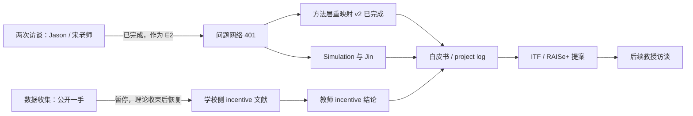

# CRF Manifesto / 科研白皮书

> 本文件包含模板头部与正文 v0.1；正文以 V400 实际冻结的 401 题（380 + 21 GAP 新题）为基准。

## ① 位置 / Obsidian 定界

- 主文件：`D:\睿谊的WPS\Ferrariwork\CRF\CRF_Manifesto_科研白皮书.md`
- 进度入口：`D:\Obsidian\Intern-research\2-活动项目\港大科创园实习\CRF项目\项目日志.md`
- Obsidian 指针页：`D:\Obsidian\Intern-research\2-活动项目\港大科创园实习\CRF项目\CRF-Manifesto.md`
- Obsidian 只放指针页，不复制白皮书正文。
- 定界判据：删掉这条，丢的是历史 → 项目日志；丢的是现状 → 白皮书 `00 当前状态`。

## ② 视图 vs 源 · 宪法声明

> 本白皮书是“研究内容视图”，不拥有任何可重算数字。数字、打标、网络指标、台账、数据文件的唯一权威在原子文件；本文只引用、解释、导航，不复制并成为第二份权威。

- 所有数字必须带：`来源文件 + AS-OF 日期 + 生成脚本`
- 示例：`114题打标_文献vs田野.md · AS-OF 2026-09-09 08:05 · 生成脚本 tag_lit_vs_field.mjs`

## ③ 读者与用途

| 读者 | 用途 | 阅读路径 |
|---|---|---|
| 李博士 | 看研究现状、理论、数据、开放问题 | 关键结论可快速复述 |
| 项目参与者 | 同步项目历史状态和最新进度 | 术语表 + 00 状态 + 来源回链 |

## ④ 证据级别 E1–E4

| 级别 | 含义 | 对应现有标记 |
|---|---|---|
| E1 | 已核实文献事实 | 台账 `✅ / ✏️`，或打标中“文献已覆盖且置信 1”的文献源 |
| E2 | 田野 / 录音 / 会议一手材料 | 来源 `Rec / meeting / 田野` |
| E3 | Ferrari / 我方框架推断 | 打标置信 2、原创框架 |
| E4 | 待核实 / 待溯源 | 台账 `❓ / 🚩`、`待核实` |

## ⑤ 成熟度标记

| 标记 | 含义 | 当前典型对象 |
|---|---|---|
| `FROZEN[ver N]` | 已核实冻结；改需重走核实并留痕 | 台账、V114 题库范围、V400 题库范围 |
| `SOFT` | 软化冻结，等精读后定 | gap 内层 |
| `DRAFT` | 草案 / 待验证假设 | H1–H6、V400 证据轴 |
| `TODO` | 尚未补 | 教学法中介排除 |

## ⑥ 00 当前状态

只写研究内容状态快照，不写任务流水。

- gap：外层 `FROZEN`；内层 `SOFT`。
- V114：题库范围 `FROZEN[ver 1]`；打标 `文献已覆盖 38 / 研究空白 60 / 理论迁移 16 / 待核实 0 · AS-OF 2026-09-09 08:05 · tag_lit_vs_field.mjs`。
- V400：题库范围 `FROZEN[ver 1]`；构成 `114 + 260 + 6 + 21 = 401`；种子 `66 = 57 非 TA 研究空白 + 9 TA 专项`；可视化已上线 `crf.ferrari11.com`；`401 节点 / 1607 边 / 平均度 8.015 / 19 簇 / modularity 0.6753 · AS-OF 2026-09-15 · link.py + cluster.py`。打标：`stakeholder` 多值 23 节点（2 方 11 / 3 方 5 / 4 方 3 / 5 方 4）；`theory_tags` 48/401（粗层标签实例 47、细层标签实例 4：stakeholder_salience 2 / public_goods 1 / club_goods 1）；`citations` 非空 18 节点 · `AS-OF 2026-09-16 · build_401_tagging.py + apply_tags.py`。扩题未做新文献搜索，文献口径待定；V400 状态热力图见 `汇报材料/热力图_v400_状态_五方四桶.png`。
- V400 状态热力图：401 题四桶 = 文献已覆盖 38 / 研究空白 347 / 理论迁移 16 / 待核实 0 · AS-OF 2026-09-15 · 详见 `热力图_v400_状态_明细.md`。
- 对外交付件：`报告/2026-09-09_V400交付说明-给李博士.md`（派生件，不作为数字权威）。
- 网络指标轴：`metrics.json` 数值只描述“问题库存结构”，不描述现实校企合作世界。
- 方法/解释层：`0.6/0.4`、`k=6` 的敏感性结论见 `调研笔记/C06_敏感性报告.md`（FINAL-已重跑401）；19 簇双语命名已按内部命名表回改 `graph.js` 并部署。
- 方法/链步骤：`four step chain` v2 重映射已完成，`chain_steps` 已回写 `nodes.json` 与 `graph.js`；单标签 294 / 双标签 33 / 链外 74。
- 待补：`Alignment 0 题`、教学法经 learning outcome 的中介排除。
- 第五块理论：`public_goods` / `club_goods` 已登记为细层候选，出处 Samuelson 1954 / Buchanan 1965 已核实，首挂题 `public_goods → ENT/EXP-012`、`club_goods → TCH/EXP-049`。
- 细层清理：`social_exchange` / `academic_capitalism` 因唯一 citation 未核实，2026-09-16 从 `theory_tags` 与 registry 撤下；`Mitchell 1997` DOI 已回填并解除待核实。
- 交叉引用：`TODO 教学法中介排除 ↔ DRAFT H6`。
- 阻塞与等待：回链 `项目日志.md`。

## ⑦ 附录 A · 双语术语表

| 中文 | 英文 | 一句话定义 |
|---|---|---|
| Efficiency ≠ Alignment | Efficiency ≠ Alignment | 激励对齐不等于效率，是两步 |
| 谁更着急 | who is more eager | 学校强弱决定谁更有议价权 |
| 先试后买 | try-before-you-buy | 企业通过实习低成本筛选人才 |
| 激励传导断裂 | incentive transmission break | 院系 urgency 传不到教师个体 |
| 羊毛出在猪身上 | value capture by a third party (not the producer) | 价值成本由第三方承担，而非产生价值的一方 |
| 价值创造先于价值获取 | value creation before capture | 早期表述：先定义价值创造，再谈谁承担成本 |

## Schema 约束

### 假设卡字段

每条 `DRAFT` 假设必须包含：

- `ID`
- `假设句`
- `证据级别`
- `来源`
- `判别设计 / 测量策略`
- `所需数据`
- `状态`

### 数据记录字段

每条数据记录必须包含：

- `口径`：`A=KT/科研商业化`、`B=校企合作教育`、`C=其他/社区公民参与`、`U=待分类`
- `可得性`：`已到手 / 可采集 / 可构造 / 暂不可及`
- `公开性`：`可公开 / 仅内部 / 敏感`
- `证据级别`：`E1–E4`
- 附加：`来源文件 + AS-OF + 生成脚本`

### 文献卡建卡判据

值得建卡 ⇔ 它支撑正文一条 `FROZEN/SOFT` 结论，或一条反方威胁。

### FROZEN 变更规则

版本历史留在原子文件；白皮书只带 `FROZEN[ver N] + 回链`。

---

# 正文

> 本版正文以 V400 实际冻结的 **401 题**（380 + 21 GAP 新题）为基准。

## 1. Manifesto / 项目主张

- 研究对象：企业进入高校本科课堂的“教学合作治理”，不是一般校企科研合作。
- 学科切入：管理 / 治理与机制设计，不是教学法。
- 五方：企业、院系、教师、助教、学生。
- 四步链条：Incentive → Incentive Alignment → Efficiency → Impact。
- 核心命题：`Efficiency ≠ Alignment`；激励对齐不等于效率，是两步。
- 双向治理：企业过冷时“请进来”；企业过热时“防捕获”。
- 状态：本节为 `DRAFT`；教学法视角排除与中介路径为 `TODO`。

## 2. 研究现状

### 2.1 三支文献互相不通

现有校企合作文献分三支，却互不相通：

| 支 | 问题 | 边界 |
|---|---|---|
| 教育 / 工程 | 怎么教、学生学了什么 | 有教学，无治理 |
| 管理学治理 | 大学—企业科研合作怎么匹配、怎么承诺 | 有治理，无教学 |
| 高教 / 批判社会学 | 企业过强如何捕获院校 | 有批判，无机制设计 |

来源：`调研文献/Lit_Review_08_合成_学者谱系与Gap定位.md`；证据级别 `E1`。

### 2.2 七种模式

| 模式 | 一句话结论 | 谁更着急 |
|---|---|---|
| 共教 | 散在低层教育刊，无治理镜头 | 中间态 |
| 真实项目 | 全在工程教育，问学生学到什么 | 中间态 |
| 实习 | 唯一有管理理论，但镜头只照企业单边 | 学校求企业 |
| COOP | 制度化最深，头号障碍=企业激励不足 | 学校求企业 |
| 比赛 | 企业办赛=branding+人才池 | 企业求人才 |
| 黑客松 | 钱几乎不流动，激励=挑战+信号 | 企业求人才 |
| 明星课 | 企业砸钱抢人才，威胁院校自主 | 企业求学校 |

来源：`调研文献/Lit_Review_08_合成_学者谱系与Gap定位.md`；证据级别 `E1`。

### 2.3 为什么关键中文文献是富矿

1. 英文圈研究校企合作教学，但不带经济学治理镜头。
2. 德语区有治理社会学与严格经济学，但对象锁死 VET / 学徒制。
3. 中国有持续政策链与国家级经费，形成中文规范 / 对策文献富矿。

来源：`报告/2026-08-27_文献核实与热力图v2交付说明-给李博士.md`；证据级别 `E1`。

### 2.4 Gap 声明

- 外层：`FROZEN`。现有研究没有把“机制设计镜头”对准“企业进课堂的教学合作”。
- 内层：`SOFT`。真正空位是“供给方 incentive 成熟理论未迁移到本科课堂” + “院系 urgency 传导不到教师个体”。
- 内层最终措辞等 5 篇精读后再定。

来源：`调研文献/Lit_Review_10_供给方激励与Gap修正_合成.md`；证据级别 `E1/E3`。

## 3. 理论工具箱

### 3.1 四块诺奖工具

| 工具 | 一句话 | CRF 接口 | 状态 |
|---|---|---|---|
| 信号传递 | 门槛要对骗子更贵，才能分离型别 | 企业投入、带教、续约哪个是真信号 | `DRAFT` |
| 多任务委托代理 | 加强可测激励会赶走不可测投入 | 老师 / 助教为什么被机制挤走 | `DRAFT` |
| 机制设计 | 想要结果，反推规则 | 五方 incentive 对齐的正式语言 | `DRAFT` |
| 型别空间 | 面对的不是“企业”，是型别分布 | 让企业自选合作档位 | `DRAFT` |

来源：`调研文献/Lit_Review_09_四块工具理论_精读导航.md`；证据级别 `E1`。

### 3.2 外围镜头

- Stakeholder Salience：`Mitchell, Agle & Wood 1997`，把五方翻译成 power / legitimacy / urgency。
- 交易成本经济学：谁承担搜寻、签约、带教、监督、退出成本。
- Academic Capitalism / Triple Helix：企业与大学权力边界，防捕获的反方。
- Social Exchange：`Kemp et al. 2021`，学生短期劳动不是零价值，企业获得组织价值。

来源：`调研笔记/Stakeholder_Theory_精读笔记.md`、`调研文献/Lit_Review_08_合成_学者谱系与Gap定位.md`；证据级别 `E1/E3`。

### 3.3 第五块

- `公共品`：企业为什么理性搭便车；学校声誉、通用人才池、标准化课程模板等基础设施若由单个企业投入，收益会外溢。经典出处：Samuelson, Paul A. (1954). “The Pure Theory of Public Expenditure.” *The Review of Economics and Statistics*, 36(4), 387–389. DOI: 10.2307/1925895。已首挂 `ENT/EXP-012`。
- 俱乐部产品：把共享收益做成可排他的会员制；只有参与合作的企业才能接触学生、进课堂、获得背书。经典出处：Buchanan, James M. (1965). “An Economic Theory of Clubs.” *Economica*, New Series, 32(125), 1–14. DOI: 10.2307/2552442。已首挂 `TCH/EXP-049`。

## 4. 可触及数据

数据证据级别在数据语境下解释为：`E1=原始已核实数据`、`E2=田野/录音`、`E3=我方生成`、`E4=待核实`。

| 数据对象 | 口径 | 可得性 | 公开性 | 证据级别 | 权威文件 |
|---|---|---|---|---|---|
| HKU 工学院课程 / 教学大纲 / 条例 | B | 已到手 | 可公开 | E1 | `数据/HKU_Engineering_Course_Data_v2.xlsx`、`数据/syllabus_pdfs/` |
| 四校对标 | B | 已到手 | 可公开 | E1 | `数据/three_school_benchmarking.xlsx` |
| 企业参与 / 企业名单证据 | B | 已到手 | 可公开 | E1 | `数据/company_participation_evidence.xlsx`、`数据/company_names_evidence.xlsx` |
| 企业课程深度分类 / proposal 对照 | B/C | 已到手 | 仅内部 | E3 | `数据/course_deep_classification.xlsx`、`数据/proposal_course_mapping.xlsx` |
| GRF 十年 / HKU 中标项目 | A | 已到手 | 可公开 | E1 | `数据/GRF_10Year_Analysis.xlsx`、`数据/grf_hku_projects.json` |
| HKUST 课程 | U | 已到手 | 可公开 | E1 | `数据/hkust_courses.json` |
| 教师邮箱 | C | 已到手 | 敏感 | E1 | `数据/faculty_emails.json / xlsx`，不可入正文 |
| 问题网络 JSON | U | 已到手 | 可公开 | E3 | `可视化/web/data/nodes.json / edges.json / metrics.json` |
> 附加字段：AS-OF 以各权威文件最后修改时间为准；生成脚本见 `CRF/脚本/` 或对应采集记录。本表不复制可重算数字。

可采集、可构造、暂不可及：

- 可采集：香港八大公开数据、美国前 100 大学课程数据、访谈 / 问卷、HKU 图书馆文献。
- 可构造：V400 参数化模型、仿真课程运行、V400 状态热力图。
- 暂不可及：企业真实纵向留存、教师真实 KE / 教学投入、企业内部 KPI / 预算科目。

## 5. 问题库与网络发现

### 5.1 V114 基线

- 题库范围：`FROZEN[ver 1]`。
- 题数：`114`，五方：企业 46 / 院系 30 / 教师 22 / 助教 4 / 学生 12。
- 打标：`文献已覆盖 38 / 研究空白 60 / 理论迁移 16 / 待核实 0 · AS-OF 2026-09-09 08:05 · tag_lit_vs_field.mjs`。
- 置信：`1=65 / 2=49 / 3=0`。

### 5.2 V114 网络

- `114 节点 / 491 边 / 平均度 8.61 / modularity 0.712`。
- 中心是“激励对齐 + 持续性”，不是单一 stakeholder。
- 三个桥题：`INS-07`、`STU-10`、`INS-03`。

来源：`汇报材料/问题网络解读_2026-09-05.md`；证据级别 `E3`。

### 5.3 V400 当前快照

- 题库范围：`FROZEN[ver 1]`；证据轴：`DRAFT`。
- 构成：`114 + 260 + 6 + 21 = 401`；种子 `66 = 57 非 TA 研究空白 + 9 TA 专项`。
- 可视化：`401 节点 / 1607 边 / 平均度 8.015 / 19 簇 / modularity 0.6753 · AS-OF 2026-09-15 · link.py + cluster.py`。
- 五方：企业 155 / 院系 82 / 教师 83 / 助教 39 / 学生 42。
- 四步链：单标签 294 / 双标签 33 / 链外 74；按标签出现次数 Incentive 153 / Impact 90 / Efficiency 70 / Incentive Alignment 47。
- 文献口径：本轮扩题未做新文献搜索，DOI 命中为 0；没有新文献热力图。

## 6. Idea / 假设日志

| ID | 假设 | 证据级别 | 判别设计 / 测量策略 | 所需数据 | 状态 |
|---|---|---|---|---|---|
| H1 | 企业根本回报是观察人才，不是项目成果 | E3 | 比较企业续约 / 带教 / 招聘的 revealed 行为，不用自述；先处理 `ENT-17`、`ENT-20` | 企业续约 / 带教 / 招聘的 revealed 面板数据 | `DRAFT` |
| H2 | 课前动员会能把年流失率从 75–80% 降到 60% | E2/E3 | 动员会干预的准实验 / 随机分组，观测续约率 | 动员会干预组与对照组的年续约率 | `DRAFT` |
| H3 | circular topic 能同时解决新鲜感与进阶感 | E2/E3 | 对比同一企业连续多年换赛道 vs 固定赛道的投入与续约 | 同一企业连续多年换赛道 vs 固定赛道的投入与续约数据 | `DRAFT` |
| H4 | 持续性靠企业可替换、对接成本低 | E3 | 拆解搜寻 / 签约 / 磨合 / 退出成本，追踪替换成本 | 搜寻 / 签约 / 磨合 / 退出成本逐环节数据 | `DRAFT` |
| H5 | 企业 incentive 至少 6 类，且不同类型驱动不同企业 | E2/E3 | choice / conjoint 或 panel 识别，不靠自述 | choice / conjoint 或企业面板数据 | `DRAFT` |
| H6 | 持续性若经 learning outcome 中介，则续约与学习产出挂钩；若经人才观察 / 声誉 / 关系驱动，则脱钩 | E3 | 不用企业自述；用滞后独立学习产出 + revealed 续约，firm-type × 时间结构；先确认企业是否测量 learning outcome | 滞后独立学习产出 + 企业续约，firm-type × 时间面板 | `DRAFT` |

来源：`调研笔记/持续性难题_假设清单.md`；H6 由 `TODO 教学法中介排除` 派生。

## 7. 文献地图 / 找回入口

- 现有精读卡 5 张：Acemoglu-Pischke 1998、Holmström 2017、Myerson 2008、Zhang 2024、潘丽云-何兴国 2020。
- 总览：`D:\Obsidian\Intern-research\2-活动项目\港大科创园实习\CRF项目\文献卡\0-文献总览.md`
- 精读导航：`调研文献/Lit_Review_09_四块工具理论_精读导航.md`。
- 合规台账：`调研文献/文献核实台账.md`，57 条 `0 查无此文`。
- 文献清单：`调研文献/校企合作文献清单.xlsx`。
- `TODO`：把关键论证锚点补成文献卡，不机械追求 57 条全部建卡。

## 8. 我们可能错在哪

- 最接近的威胁：多淑杰 & 郑琦 2024（本科、规范对策）、Zhang 2024 演化博弈、潘丽云 / 尹江海职教规范对策、Acemoglu-Pischke 学徒制系列。
- 当前核验：`致命 0 / 严重 4 / 轻微 3 / 不构成 1`。
- 反方缺口：`TODO` 教学法经 learning outcome 间接解释持续性，必须写成可检验的竞争假设。
- 反方缺口：`TODO` 正式论证“治理 / 机制设计视角”为何不能由教学法替代。
- 网络指标只描述问题库存结构，不描述现实校企合作世界。

来源：`调研文献/文献核实台账.md`、`调研文献/Lit_Review_10_供给方激励与Gap修正_合成.md`；证据级别 `E1/E3`。

## 9. 项目里程碑（AS-OF 2026-09-15）

> 来源：`D:\Obsidian\Intern-research\2-活动项目\港大科创园实习\CRF项目\项目日志.md`。本表只做里程碑导航，具体数字以日志和对应原子文件为准。

| 时间 | 里程碑 | 对下一步的作用 |
|---|---|---|
| 2026-08-04/05 | 港大工学院课程数据：89 份大纲、3,816 条课程记录、650+ 课程代码；完成三校对标准备与 `INTC3002` 高亮 | 证明学校侧公开数据可整理，先立“学校侧”证据底座 |
| 2026-08-06/08 | 企业名单与教师画像：`CIVL2114` 2023–2025 三年企业名单、152 名教师邮箱、综合 Excel | 发现企业参与并非零，有 11 家连续三年参与；用于反驳“企业进不来”的简单诊断 |
| 2026-08-10 | GRF 十年分析交付李博士 | 形成“港大研究经费高、校企课程占比低”的对照证据 |
| 2026-08-12 | 四校治理全景 + 四个猜想验证 + PPT | 把叙述从“缺乏制度”升级为“从合规升级到卓越” |
| 2026-08-19 | 7 模式文献调研完成 | 锁定 gap = 机制设计 × 企业进课堂（教育侧） |
| 2026-08-21 | 两次一手访谈：宋老师 / 宋教授（港科大，中文）、Jason（港大，英文） | 建立 E2 一手材料，提供“效率≠对齐”等概念来源 |
| 2026-08-24/26 | 问题网络五方重组、首批 108 题、热力图 v1 | 进入“先定位问题、再谈方案”的方法路线 |
| 2026-08-30 | 问题网络部署到 `crf.ferrari11.com` | 可视化成为对外沟通和内部检索的稳定入口 |
| 2026-09-08 | V114 打标交付：文献已覆盖 38 / 研究空白 60 / 理论迁移 16 | 把“题库”升级为“带证据的问题库存” |
| 2026-09-09 | V400 扩题并冻结 380（114 + 260 + 6），生成 380 节点 / 17 簇 | 确定当前研究对象的范围与可重算指标 |
| 2026-09-13 | 白皮书 v0.1、Simulation 交接卡、与李博士周会 | 确定白皮书 = 正式 project log，明确与 Jin 并行分工 |
| 2026-09-15 | 补 21 题 GAP 新题至 401，重跑网络为 1607 边 / 19 簇；19 簇全量重命名；`chain_steps` v2 重映射 | 明确当前题库正式称为 401 题，统一对外口径与文档 |
| 2026-09-15 | 回写 `stakeholder` 多归属 23 节点与 `theory_tags` 两层（粗层 46 + 细层 5） | 问题网络筛选维度从单方/四理论扩展为多方/七理论标签 |
| 2026-09-16 | 401 引用清理：回填 `Mitchell 1997` DOI，撤下唯一 citation 未核实的 `social_exchange` / `academic_capitalism` | 细层 4、`theory_tags` 48/401、active citation 无未核实 |

## 10. 推进线状态（AS-OF 2026-09-15）

> 本节的“推进 / 暂停”是李博士 2026-09-13 周会确认后的工作安排，不是研究结论。

### 10.1 数据收集线曾经推进到哪里

- 已完成：港大工学院课程与大纲、`CIVL2114` 三年企业名单、`COMP3410/COMP3510` 企业名单、152 名教师邮箱、GRF 十年数据、PolyU 四系 463 门课程。
- 已受阻：CUHK 课程目录藏在 CUSIS 学生门户后、ECE 教师页被 Cloudflare 封锁、课程—教师对应关系缺少非公开渠道。
- 当前状态：公开一手数据收集暂时停住，等理论收束后按“先学校侧、后企业侧”再恢复。

### 10.2 仍在推进的线

| 线 | 内容 | 下一步 |
|---|---|---|
| 问题网络方法层 | 401 题已冻结（380 + 21 GAP）、19 簇已命名；已完成 `four step chain` v2 重映射（`chain_steps`）；已完成 `stakeholder` 多归属回写与 `theory_tags` 两层补标 | 推送 `crf-question-network` 与 `crf-project-log` 前先确认代理，并线上复核 |
| 白皮书 / project log | 直接填正文，作为 Jin、教授和新成员的项目入口 | 本文件随各线进展持续更新 |
| Simulation | 与 Jin 完整同步；两人各自写 COA、各自查 simulation 文献，筛 10 个 simulation-first 问题 | 先给 Jin 交接卡 + 本白皮书 + 三个 JSON |
| 学校侧 incentive 文献调研 | 先查老师为什么愿意/不愿教这类课，再回企业侧 | 产出可引用文献证据，避免“我觉得” |
| ITF / RAISe+ 平台提案 | 校企对接平台：历史数据、5 万级单课题赞助、Project Designer AI Bot、AI 替代基础答疑 | 截止日 2026-10-30 前完成 proposal |
| 后续两位教授访谈 | 起草问题清单，围绕企业来源、满意度、留存、摩擦、教师成本等 | 清单先交李博士核对，再约时间 |

### 10.3 暂时停住的线

- 大规模系统访谈：等核心问题清楚后再启动 40–50 人规模的访谈，当前不铺开。
- 企业侧一手数据采集：先做学校侧，企业侧后置。
- 公开数据继续采集：CUHK/ECE 等技术障碍和课程—教师映射问题暂不强行解决。

