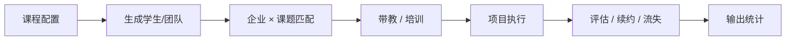

# Simulation 交接卡（给 Jin）

> 状态：DRAFT v0.2 · 2026-09-13（09-13 周会后口径）
> 用途：让 Jin 不用先读完整白皮书，就能知道 CRF 的 simulation 要建什么、先回答哪些问题。
> 权威正文：`CRF/CRF_Manifesto_科研白皮书.md`；本卡是建模入口，不是结论文件。

## 1. 一句话目标

在给定老师、助教、学生、企业、院系的属性与约束下，simulation 要能回答：

- 什么样的“企业 × 老师 × 课题 × 学生”组合，最终 average satisfaction 最高？
- 什么样的配置，企业续约率最高、学习产出最高？
- 在哪些位置最容易出现 conflict、project 失败或激励断裂？

## 2. 建模对象

| 对象 | 角色 | 关键属性（先粗后细） |
|---|---|---|
| Student | 项目执行者 / 学习者 | intelligence、team collaboration、communication、prior skill、time budget |
| Team | 项目最小执行单元 | 成员组合、分工、协作强度、冲突 |
| Instructor | 课程设计 / 管理 | time、attention、commitment、communication、incentive（评职称等） |
| TA | 承重墙 / 对接 | workload、mentor 对接、grading、continuity、compensation |
| Firm | 出题 / 带教 / 观察 | incentive type、size、mentor availability、business clock、renewal logic |
| Institution | 制度 / 资源 | policy、urgency、resource allocation、degree regulations |
| Course / Project | 场景 | openness、money demand、data demand、learning curve、timescale |

## 3. 关键约束（来自 09-06 李博士）

- 学生不必先做“真实异质性”，可先把 `intelligence / team collaboration / communication` 设为高斯分布。
- 每类对象最终用 10–20 个 index 刻画；每个 index 只用 0–1 相对值，不做绝对值。
- 不同对象、不同 index 之间允许交互，例如“老师话多”会加快信息流，也可能挤占学生独立试错时间。
- 优化目标：不降低各 stakeholder 的总投入、总 energy、总 happiness，只重新分配时间 / 精力 / 情感分布，让整体效果更好。
- 可先跑 40 人课与 100 人课两个规模。

## 4. 建议的初始属性向量

| 对象 | 建议 index | 分布 / 约束 |
|---|---|---|
| Student | intelligence、collaboration、communication、effort、prior_knowledge | 前三项 Gaussian(0.5, 0.15)，clip 到 0–1 |
| Instructor | time_available、attention_span、commitment、communication、promotion_incentive | 0–1；部分来自访谈/假设 |
| TA | workload、liaison_load、grading_load、continuity、compensation | 0–1；TA 文献最薄 |
| Firm | incentive_type、size、mentor_time、business_clock、renewal_threshold | 分类 + 0–1 |
| Project | openness、money_demand、data_demand、learning_curve、time_horizon | 0–1；learning_curve 决定学生何时达到可用产出 |

## 5. 运行流程

## 6. 输出变量

| 输出 | 定义 | 对到假设 |
|---|---|---|
| average satisfaction | 学生/老师/企业/助教满意度的均值 | 总体优化目标 |
| renewal rate | 企业下一轮是否续约 | H1、H2、H4、H5 |
| learning outcome | 独立于企业评价的学习产出 | H6 |
| mismatch / conflict | 项目失败、冲突、成本上升 | 机制设计诊断 |
| time reallocation | 各方时间/精力/情感重分配 | “不增加总投入”约束 |

## 7. 用 H1–H6 做 simulation probe

| 假设 | 在 simulation 里怎么测 |
|---|---|
| H1 企业买的是“观察人才”，不是项目成果 | 让企业 utility 只吃 talent signal，对比只吃 project output，看续约差异 |
| H2 动员会把流失率从 75–80% 降到 60% | 加/不加课前动员会，比较 renewal rate |
| H3 circular topic 同时解决新鲜感与进阶感 | 同企业换赛道 vs 固定赛道，比较投入与续约 |
| H4 持续性靠企业可替换、对接成本低 | 改变搜寻/签约/磨合/退出成本，看系统对单企业流失的韧性 |
| H5 企业 incentive 至少 6 类 | 给企业赋不同 incentive type，看不同 firm type 的行为分叉 |
| H6 learning outcome 中介续约 | 滞后独立学习产出进入企业续约决策，检验中介 vs 脱钩 |

## 8. Jin 判断可建模性时要处理的 8 个问题

> 09-13 周会后不再要求 Jin 只是“确认我们想问什么”；而是由 Jin 基于现有材料，判断哪些研究问题适合 simulation、能回答哪些问题。

1. 最小可运行版本先保留哪些 agent 和变量？
2. 每个 agent 的 10–20 个 index 具体是什么、怎么量化？
3. agent 之间的交互规则用什么形式：规则式、效用函数，还是 ABM？
4. 参数先 synthetic，还是用香港八大数据做 calibration？
5. 时间粒度是一节课、一个学期，还是多年循环？
6. 优化目标用 satisfaction 均值、renewal rate，还是多目标 Pareto？
7. “不增加总投入”约束在数学上如何写？
8. 第一轮只跑 40/100 学生，还是直接加团队结构？

## 9. 数据现状

- 白皮书第 4 节已有“可触及数据”清单：HKU 课程/教学大纲、三校对标、企业参与证据、GRF 数据等。
- 已公开下载：`Zhang 2024`、`Em & Khampirat 2026`。
- 文献下载清单：`2026-09-14（周一）` 从 Mindy 领取，归档到 `CRF/调研文献/`，并同步文献核实台账；原待港大/李博士渠道清单为 23 条。
- 可构造：V400 参数化模型、仿真课程运行、V400 状态热力图。

## 10. 下一步（09-13 周会后）

- Ferrari：先把“白皮书 + 本交接卡 + 380 问题网络（网址及 JSON）”完整同步给 Jin，并约同步时间。
- Jin：先读本卡和问题网络，白皮书用作项目背景，不必逐字读完全部；再根据已有材料提出“哪些研究问题可以先 simulation”。
- 两人各自独立写 COA，先不合并，避免互相影响。
- 两人各自查“校企合作领域已用 simulation 的 paper”，不要重复做同一批检索。
- 合并 COA 后，共同筛出 10 个可先用 simulation 解决、不必先访谈的问题。
- 后续 380 题 `four step chain` 重映射会继续，Jin 先基于当前 380 网络理解问题结构，分类字段后续会再更新。
